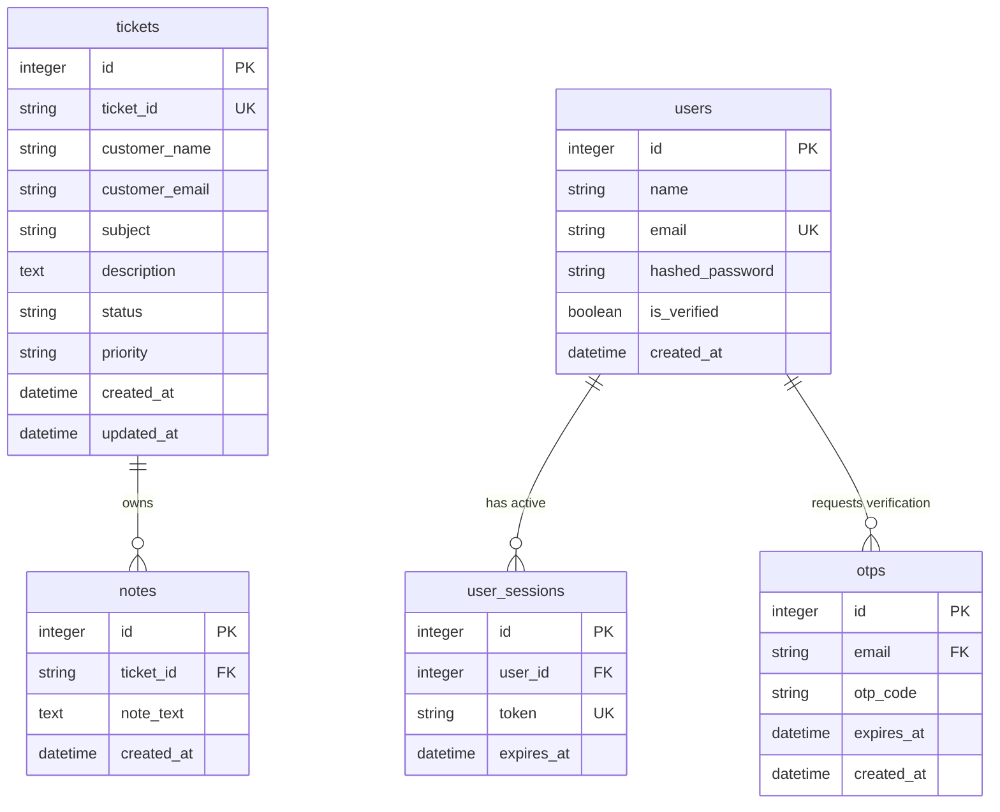

📖 Project Overview

**SupportFlow** (built under the application brand **SupportDesk**) is an enterprise-grade Customer Relationship Management (CRM) and support ticket portal. It was built to solve the challenges of chaotic email chains, disjointed team workflows, and complex tool setups by unifying customer ticket submission and agent operations into a single cohesive, high-performance workspace.

### The Problem It Solves
Traditional ticketing systems are either too basic (offering no tracking) or over-engineered (requiring massive setup overhead, database migrations, and complex licensing). **SupportFlow** bridges this gap:
* **For Customers:** It provides an ultra-clean, frictionless ticket-raising interface where queries can be submitted instantly.
* **For Support Agents:** It provides a sleek, real-time workspace featuring live analytics, instant search, status pipelines, and persistent activity logs.
* **For Technical Evaluators:** It showcases clean division of concerns, modular React architecture, a robust SQLite database-backed session system, and production-quality aesthetics.

---

## ✨ Key Features

*   **⚡ Frictionless Customer Ticketing:** Customers can raise support tickets instantly without logging in. The system automatically creates a collision-safe, readable ID (e.g., `TKT-001`, `TKT-002`) and sends verification status.
*   **🔒 Secure Agent Onboarding & Verification:** Agents register with email verification. Integration with Gmail SMTP sends a 6-digit OTP code (with an instant console logging fallback if credentials aren't configured).
*   **🛠️ Database-Backed Sessions:** Custom session management using database-stored tokens with 30-day expirations and automatic client-side logout using Axios response interceptors.
*   **📊 Live Operational Metrics:** Real-time summary dashboard showing counts for Total, Open, In Progress, and Closed tickets.
*   **🔍 Instant Live Search & Filtering:** Filter the ticket board dynamically by Status (Open, In Progress, Closed) or Priority (High, Medium, Low) and perform instant search indexing on IDs, customer names, emails, and subjects.
*   **📅 Timeline Activity Logs:** Agents can write internal progress notes or customer replies. Each note is saved with timestamps and displayed in a relative time-log timeline.
*   **📤 Data Export:** Export the current filtered tickets table to CSV format dynamically for reporting.
*   **🌗 Premium Dark Mode & Fluid UI:** Seamlessly switch between dark and light themes with state persistence. Designed with custom fonts, glassmorphism, micro-animations, and smooth transitions.

---

##  Demo

### Customer Portal (Landing page & Form)
*A high-fidelity landing page displaying support metrics, testimonials, and the public ticket submission form.*

### Agent Dashboard
*The centralized agent console featuring ticket metrics, search inputs, pills filters, sorting, and paginated records.*

### Ticket Detail & Operations
*The operational console for updating ticket state, reviewing client description, and appending progress notes onto the activity log.*

*   **Live Demo:** https://support-flow-chi.vercel.app/ 
*   **Walkthrough Video:** `https://drive.google.com/file/d/1tF18JDvoxga_O105UgFjJeGnHVXFcz10/view?usp=drive_link*

---

## 🛠️ Tech Stack

| Layer | Technology | Description |
| :--- | :--- | :--- |
| **Frontend Core** | React 19 | Standard UI component library with Hooks and Context APIs. |
| **Frontend Tooling** | Vite 8 | Fast dev compiler and module bundler. |
| **Styling** | TailwindCSS v3 + Vanilla CSS | Utility classes combined with customized transitions and variables. |
| **Routing** | React Router DOM v7 | Single Page App (SPA) routing with protected paths. |
| **API Client** | Axios | Configured with automatic request headers and 401 response interceptors. |
| **Icons** | Lucide React | High-quality, clean vector iconography. |
| **Toasts** | React Hot Toast | Elegant notification toasts with blur glassmorphism borders. |
| **Backend Core** | FastAPI 0.111.0 | High-performance Python web framework built on ASGI. |
| **Web Server** | Uvicorn 0.29.0 | Fast ASGI server implementation. |
| **ORM / Database** | SQLAlchemy + SQLite | Relational database mapping with zero-setup file-based SQLite database. |
| **Validation** | Pydantic v2 | Strict request payload structure checking and email syntax validation. |

---

## 📐 Project Architecture

graph TD
    subgraph Client [Frontend React App]
        Landing[Landing & Create Ticket]
        Auth[Login / Sign Up / Verify OTP]
        Dash[Agent Dashboard]
        Detail[Ticket Operations Detail]
        Axios[Axios HTTP Client]
        AuthCtx[Auth Context & Interceptor]
    end

    subgraph Server [Backend FastAPI App]
        API[FastAPI Router]
        AuthSvc[Auth & Session Service]
        TktSvc[Ticket Operations Service]
        EmailSvc[SMTP Email Service]
    end

    subgraph Storage [SQLite Database]
        db[(crm.db file)]
    end

    %% Flow lines
    Landing -->|POST /api/tickets| API
    Auth -->|POST /api/auth/login| API
    Dash -->|GET /api/tickets| API
    Detail -->|PUT /api/tickets/{id}| API
    
    API --> AuthSvc
    API --> TktSvc
    AuthSvc -->|Generate Code / SMTP| EmailSvc
    
    AuthSvc -->|Queries & Transactions| db
    TktSvc -->|Queries & Transactions| db

    Axios <--> AuthCtx
    AuthCtx <--> Landing
    AuthCtx <--> Dash
    AuthCtx <--> Detail
```

---

## 📂 Folder Structure

The project has a clear partition between the client React application and the Python API service:

```bash
SupportFlow/
├── backend/                  # Python FastAPI Backend
│   ├── .env.example          # Environment configuration template
│   ├── crm.db                # SQLite database (auto-generated on startup)
│   ├── main.py               # Single-file server (Models, Routes, Schemas, Services)
│   ├── railway.toml          # Railway deployment config
│   └── requirements.txt      # Python dependencies manifest
├── frontend/                 # React Frontend
│   ├── public/               # Static public assets
│   ├── src/
│   │   ├── api/              # API Client instances
│   │   │   └── tickets.js    # Axios backend wrappers
│   │   ├── components/       # Reusable UI components (stats, badges, toggles)
│   │   ├── context/          # Dark Mode and Auth contexts
│   │   ├── layouts/          # Dashboard frame layouts & Sidebar navigation
│   │   ├── pages/            # View components (Landing, Login, Dashboard, Detail)
│   │   ├── utils/            # CSV exporters and helpers
│   │   ├── App.css           # Global layout adjustments
│   │   ├── App.jsx           # Routes and Providers configuration
│   │   ├── index.css         # Tailwind directives and core Design System tokens
│   │   └── main.jsx          # React entry point
│   ├── eslint.config.js      # Linting configurations
│   ├── index.html            # Main HTML document template
│   ├── postcss.config.js     # PostCSS configurations
│   ├── tailwind.config.js    # Tailwind layout extensions
│   ├── vercel.json           # Vercel deployment rewriting
│   └── vite.config.js        # Vite compilation configuration
└── README.md                 # Project Documentation
```

### Key Source Files Reference
* **Backend Main:** [backend/main.py](file:///c:/Project/SupportFlow/backend/main.py) — Contains all Pydantic request models, SQLAlchemy schemas, security layers, SMPT controls, and API routes.
* **Frontend Design Tokens:** [frontend/src/index.css](file:///c:/Project/SupportFlow/frontend/src/index.css) — Defines custom RGB theme colors, keyframe animations, glassmorphism cards, and default font-stack imports.
* **Axios Interceptor:** [frontend/src/context/AuthContext.jsx](file:///c:/Project/SupportFlow/frontend/src/context/AuthContext.jsx) — Manages session states and configures network middleware.
* **Agent Dashboard View:** [frontend/src/pages/Home.jsx](file:///c:/Project/SupportFlow/frontend/src/pages/Home.jsx) — Contains ticket filtering, search query updates, sorting, and pagination logic.

---

## 📋 Prerequisites

Before running the application, make sure you have the following software installed:

* **Node.js** (v18.0.0 or higher) — [Download Node.js](https://nodejs.org)
* **Python** (v3.9 or higher) — [Download Python](https://python.org)
* **SQLite3** (Usually bundled with Python)
* **Git** — [Download Git](https://git-scm.com)

---

## ⚙️ Environment Variables

### Backend Environment Configuration
Create a `.env` file in the [backend](file:///c:/Project/SupportFlow/backend/) directory. You can copy the template:
```bash
cp backend/.env.example backend/.env
```

Define the following variables inside `backend/.env`:

```env
# Origins permitted to bypass CORS (comma-separated list)
ALLOWED_ORIGINS=http://localhost:5173

# Gmail account email to send verification OTPs
EMAIL_HOST_USER=yourgmail@gmail.com

# 16-character Gmail App Password (Settings > Security > 2FA > App Passwords)
EMAIL_HOST_PASSWORD=your16charapppassword

# Optional: Custom database URI (defaults to SQLite crm.db file)
# DATABASE_URL=sqlite:///./crm.db
```

> [!NOTE]
> If `EMAIL_HOST_USER` and `EMAIL_HOST_PASSWORD` are left empty, the server will operate in **development mode**, printing all verification OTPs directly to the terminal output console and attaching them to the `/api/auth/signup` API response for easy sandbox testing.

### Frontend Environment Configuration
By default, the frontend is pre-configured to communicate with `http://localhost:8000`. To target a custom backend, create a `.env` file in the [frontend](file:///c:/Project/SupportFlow/frontend/) directory:

```env
VITE_API_URL=http://localhost:8000
```

---

## 🚀 Installation & Local setup

Follow these instructions to set up the project locally:

### 1. Clone the Repository
```bash
git clone <repository-url>
cd SupportFlow
```

### 2. Set Up the Backend API

1. Navigate to the backend folder:
   ```bash
   cd backend
   ```
2. Create and activate a virtual environment:
   ```bash
   # Windows PowerShell
   python -m venv venv
   .\venv\Scripts\Activate.ps1

   # Linux/macOS
   python -m venv venv
   source venv/bin/activate
   ```
3. Install dependencies:
   ```bash
   pip install -r requirements.txt
   ```
4. Setup environment file:
   ```bash
   cp .env.example .env
   ```
5. Start the backend development server:
   ```bash
   python -m uvicorn main:app --reload
   ```
   The backend server will run on `http://localhost:8000`. A local SQLite database file `crm.db` will be initialized in the backend directory.

### 3. Set Up the Frontend

1. Open a new terminal and navigate to the frontend directory:
   ```bash
   cd frontend
   ```
2. Install npm dependencies:
   ```bash
   npm install
   ```
3. Start the Vite development server:
   ```bash
   npm run dev
   ```
   The frontend application will boot up at `http://localhost:5173`. Open this URL in your browser to run the application.

---

## 📡 API Documentation

FastAPI automatically generates interactive Swagger API docs. With the backend server running, you can explore detailed endpoints, payloads, and request schemas at:
* Swagger UI Docs: `http://localhost:8000/docs`
* Redoc: `http://localhost:8000/redoc`

### Primary Endpoints Summary

#### Public Portal & Metadata
* **`GET /`**: API operational status diagnostics.
* **`GET /health`**: Microservice health-check endpoint.
* **`POST /api/tickets`**: Creates a support ticket.
  * *Request Body (JSON):*
    ```json
    {
      "customer_name": "Jane Doe",
      "customer_email": "jane@example.com",
      "subject": "Billing Error",
      "description": "I was double charged on my card.",
      "priority": "High"
    }
    ```
  * *Response (JSON):*
    ```json
    {
      "ticket_id": "TKT-001",
      "created_at": "2026-06-12T04:30:00.000Z"
    }
    ```

#### Agent Authentication
* **`POST /api/auth/signup`**: Creates a pending agent profile and generates a verification OTP.
  * *Request Body (JSON):* `name`, `email`, `password`.
  * *Response (JSON):* Includes `test_otp` when SMTP is unconfigured for developer testing.
* **`POST /api/auth/verify`**: Verifies agent registration.
  * *Request Body (JSON):* `email`, `otp_code`.
* **`POST /api/auth/login`**: Authenticates agent credentials and issues session token.
  * *Request Body (JSON):* `email`, `password`.
* **`POST /api/auth/logout`**: Revokes session. Requires `Authorization: Bearer <token>`.
* **`GET /api/auth/me`**: Returns profile of authenticated agent. Requires `Authorization: Bearer <token>`.

#### Agent Ticket Operations (requires Authorization header)
* **`GET /api/tickets`**: Returns list of tickets. Supports query params: `status`, `priority`, `search`.
* **`GET /api/tickets/stats/summary`**: Returns overall ticket counts by state (`total`, `open`, `in_progress`, `closed`).
* **`GET /api/tickets/{ticket_id}`**: Retrieves a specific ticket details with its full activity timeline.
* **`PUT /api/tickets/{ticket_id}`**: Updates status and/or logs a comment.
  * *Request Body (JSON):*
    ```json
    {
      "status": "In Progress",
      "note": "Looking into the billing records for customer Jane."
    }
    ```

---

## 🗄️ Database Schema

SQLite handles all data persistence locally. Below is the relational structure of the database:



---

## 🔄 Application Workflow

```
[Customer Form]              [FastAPI Backend]            [SQLite Database]
      |                              |                             |
      |--- Submits Issue ----------->|                             |
      |    (POST /api/tickets)       |                             |
      |                              |--- Generate TKT-ID -------->|
      |                              |    Check collision          |
      |                              |<-- ID approved -------------|
      |                              |                             |
      |                              |--- Insert Ticket Record --->|
      |                              |                             |
      |                              |--- Send Ticket Status ----->|
      |<-- Return TKT-ID & Success --|                             |
```

1. **Ticket Creation:** Customer fills out form on [Landing Page](file:///c:/Project/SupportFlow/frontend/src/pages/Landing.jsx). Frontend validates inputs, makes POST call, backend saves ticket details to `tickets` table and replies with the ticket code.
2. **Staff Access:** Support agent logs in. Auth context checks `localStorage` token, fetches agent details from `GET /api/auth/me`. If session is missing or expired, agent is routed to `/login`.
3. **Queue Sorting & Filtering:** Dashboard displays ticket tables. Selecting a filter pill calls `ticketsApi.list` passing query params (`search`, `status`, `priority`). Sorting is run locally on the fetched array using client-side memoized calculations.
4. **Ticket Update:** Agent clicks into `/tickets/TKT-XXX`. Agent adjusts status to "In Progress" or inputs a timeline comment. Saving calls `PUT /api/tickets/TKT-XXX`. The backend updates `updated_at`, inserts a record to `notes` table, and returns success.
5. **Activity Logs View:** The dashboard detail page updates, parsing the updated notes list.

---

## 🔒 Security Features

*   **Session Token Authentication:** Decoupled token generation (32-byte secure hexadecimal string) isolated from client-side JWT signing vulnerabilities. Sessions expire in 30 days and are tracked on the database.
*   **Password Cryptography:** Secure SHA-256 password hashing mixed with a unique application salt (`APP_SALT`) before write, preventing plaintext storage.
*   **OTP Email Verification:** Strict verification pipeline requiring OTP authentication. Non-verified agent profiles cannot log in.
*   **Input Sanitization & Validation:** Strict length limits (Pydantic models enforce character ranges from 1 to 5000) and regex-pattern matching for status values (`^(Open|In Progress|Closed)$`).
*   **Cross-Origin Isolation (CORS):** Backend restricts access headers to custom client origins listed in the `ALLOWED_ORIGINS` env config.

---

## 💡 Challenges & Solutions

*   **Challenge: OTP Testing friction in development.** Configuring SMTP servers blocks early developer workflows.
    *   *Solution:* Designed a dual-path SMTP handler. If gmail configs are missing in `.env`, the API prints verification codes to the console output and appends the code to the registration JSON API response for immediate local testing.
*   **Challenge: SQLite Single-Thread Concurrency Limitations.** Under rapid multi-tenant writes, database locking errors can occur.
    *   *Solution:* Setup SQLAlchemy connection arguments in [backend/main.py](file:///c:/Project/SupportFlow/backend/main.py) to set `check_same_thread: False` for SQLite connections, while scoping session closures inside `finally` cleanup wrappers (`get_db()` service).
*   **Challenge: Theme-change visual flicker.** Dynamic component rerendering causes styled theme shifts.
    *   *Solution:* Configured a custom transition class `.theme-transition` in [frontend/src/index.css](file:///c:/Project/SupportFlow/frontend/src/index.css) combined with Tailwind's `darkMode: "class"` toggle. This synchronizes dark theme switches across the DOM instantly without styling resets.

---

## 🔮 Future Enhancements

*   **OAuth2 Integrations:** Integration with Google and GitHub OAuth services for seamless agent login.
*   **Real-time WebSocket Updates:** Update the agent dashboard dynamically as new tickets are submitted by clients.
*   **Automated Email Updates:** Send confirmation emails to customers when an agent changes the status of their ticket or logs a new response comment.
*   **Analytics Charts:** Integrate visualization libraries (like Recharts) to graph ticket load distributions and resolution velocities over time.

---

## 🧪 Testing

Automated unit tests are planned for future releases. The codebase is designed to be easily covered using:
*   **Backend Testing:** `pytest` + `httpx` to test FastAPI routers with a clean, in-memory SQLite database.
*   **Frontend Testing:** `vitest` + `@testing-library/react` to render views and trigger filter assertions.

### Run Future Tests Guidelines
Once testing suites are installed, execute them using:
```bash
# Backend tests
pytest backend/

# Frontend tests
npm run test
```

---

## 🌐 Deployment Guide

### Backend Deployment (Railway)
1. Initialize a new service on Railway connected to your GitHub repository.
2. Select the `/backend` subdirectory.
3. Configure the environment variables (`EMAIL_HOST_USER`, `EMAIL_HOST_PASSWORD`, `ALLOWED_ORIGINS`).
4. Railway will automatically pick up the [railway.toml](file:///c:/Project/SupportFlow/backend/railway.toml) file, using Nixpacks builder to compile Python and launch the service:
   ```bash
   uvicorn main:app --host 0.0.0.0 --port $PORT
   ```

### Frontend Deployment (Vercel)
1. Import your repository into Vercel.
2. Set the root directory to `frontend`.
3. Set the build command to `npm run build` and output directory to `dist`.
4. Configure the environment variable `VITE_API_URL` targeting your live Railway backend URL.
5. Vercel will apply rewrite configurations from [vercel.json](file:///c:/Project/SupportFlow/frontend/vercel.json) to routing parameters.

---

## 🤝 Contributing

Contributions are welcome! Follow these steps to submit additions:

1. Fork the Project.
2. Create your Feature Branch:
   ```bash
   git checkout -b feature/AmazingFeature
   ```
3. Commit your Changes:
   ```bash
   git commit -m 'Add some AmazingFeature'
   ```
4. Push to the Branch:
   ```bash
   git push origin feature/AmazingFeature
   ```
5. Open a Pull Request.

---

## 📄 License

Distributed under the MIT License. See standard licensing files for details.

---

## 🧑‍💻 Author

**Your Name**
* LinkedIn: https://www.linkedin.com/in/raj-yadav-706b60397/
* GitHub: https://github.com/yraj-17

